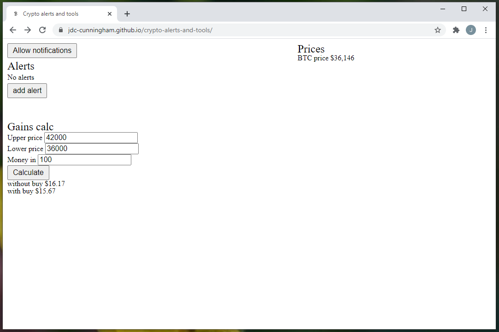

### About 

This is a basic crypto alerting tool for prices. It will alert you by desktop notification and speech.
The speech will not fire until you interact with the page.

This uses a GDAX websocket connection to get the ticker prices for comparison against your set alerts.

See this [video](https://www.youtube.com/watch?v=Ejyw6AEGXwk) of it in action

[View live page](https://jdc-cunningham.github.io/crypto-alerts-and-tools/)

There is also a little gain calc tool

Note: there is a flaw in this app, it's to do with websockets. Apparently after about a minute of the tab not being in focus it will close the socket connection. I have to put in a fix for that, maybe using web workers or something.
